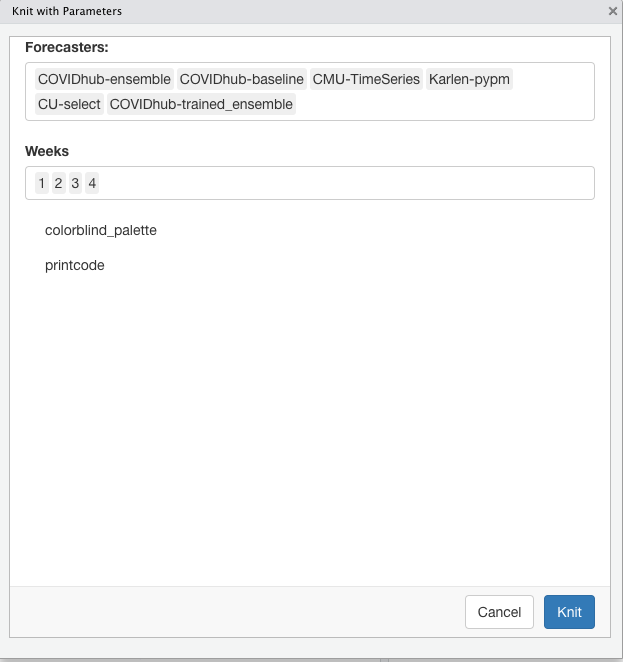
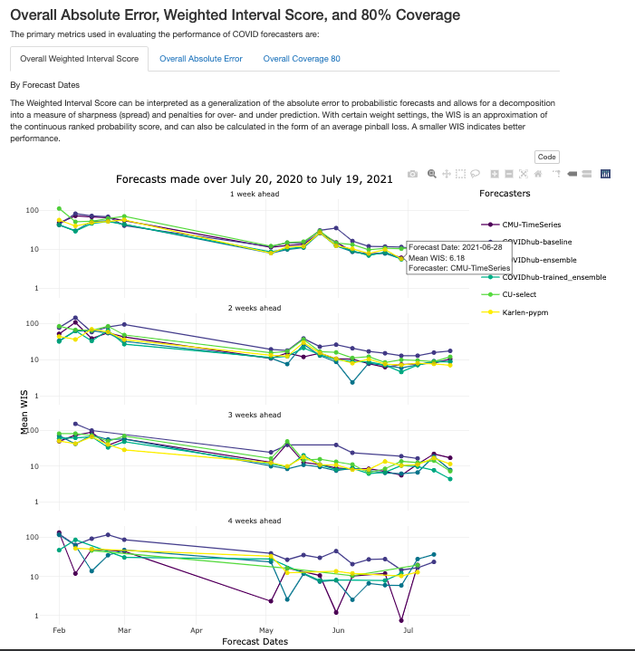
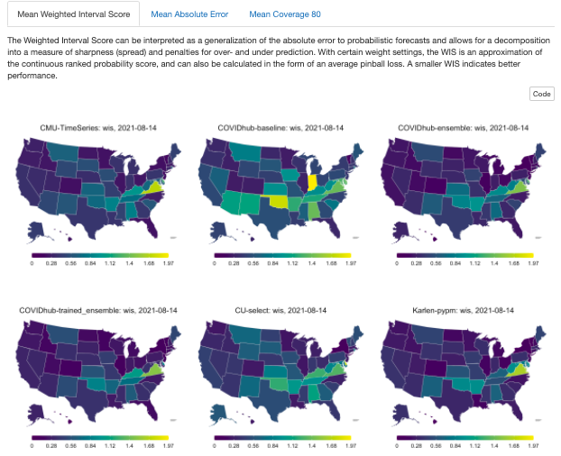
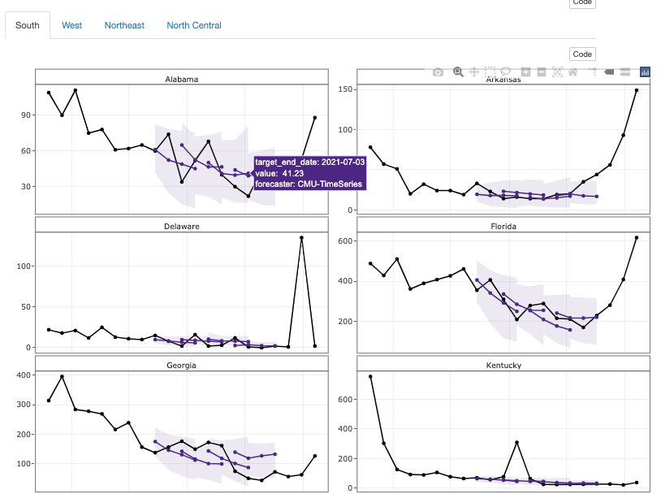
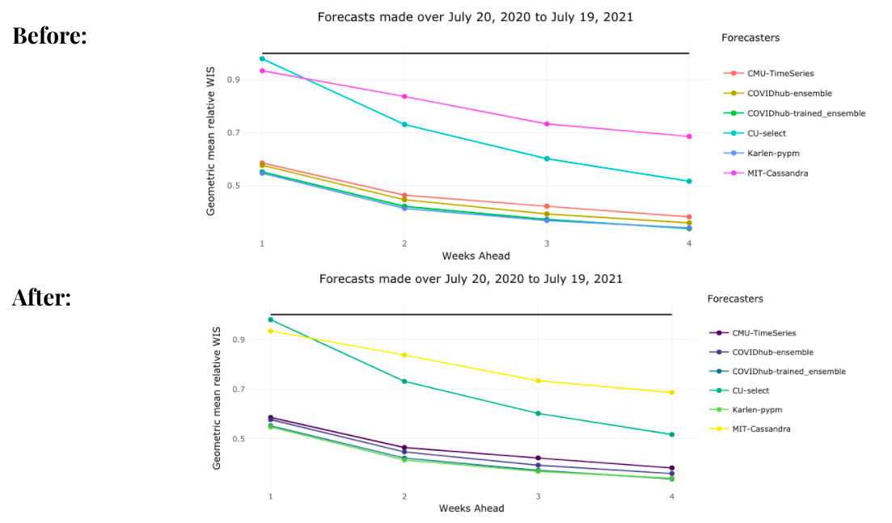

# DSSG Covidcast: Forecasting Aids for Delphi
[link to github](https://github.com/StanfordDataScience/dssg_covidcast)

#### Fellows 
* **[Michelle Lee](https://mjl2241.github.io/hi/)** recently graduated with a Master’s in Public Health (Population Health & Biostatistics) from Columbia University.
* **[Taha Bouhoun](https://github.com/Tahahaha7)** recently graduated with a Bachelor's in Computational Sciences from Minerva University. 

#### Mentors
* **[Shilaan Alzahawi](https://shilaan.rbind.io)** is a PhD student in Organizational Behavior at Stanford University Graduate School of Business. Shilaan was the technical mentor for this project.
* **Balasubramanian Narasimhan** (Stanford University) and **Daniel McDonald** (University of British Columbia, Canada) were the faculty mentors on this project. 

### Introduction

This project was completed by a team of fellows as part of Stanford's Data Science for Social Good program in the Summer of 2021, working on a project originated by DELPHI research group at Carnegie Mellon University. The end goal of our project is to develop tools for comparing and evaluating COVID-19 forecasters for deaths, cases, and hospitalizations in the United States, aiming to help epidemiological researchers gain insights into the performance of their forecasts and lead to more accurate forecasting of epidemics in the future. You can read our final report in this directory and view the slides from our [final presentation](https://github.com/StanfordDataScience/dssg_covidcast/raw/main/Final_Presentation.pdf) and [final report](https://github.com/StanfordDataScience/dssg_covidcast/blob/main/Final_Report.pdf). 

Our outputs are: 

### Parameters and Helper Functions 

Parameterized reports allow users to choose one or more parameters to customize the analysis, which users can reproduce the analysis at the click of a button. We started by specifying the parameters using the “params” field within the YAML section. Setting paramters inputs (forecasters, weeks, and colorblind palette) shortened the coding lines in the report.  The helper function was added to pull all available forecasters from the Covid-19 Forecast Hub. We now rely on parameters and helper functions to easily change the markdown parameters, as shown below.

### Interactive Graphs in Tabs

We added better interactivity to plots and they are organized by tabs for easier navigation, as shown below.

### Geographical maps
 
To contextualize the forecast evaluations, the following tabs illustrate the performance of COVID-19 forecasts across all US states over forecast dates and weeks ahead, as shown in Figure 6. Note that the results are scaled by population.

### Trajectory plots

The following plots show the predictions of the CMU-TimeSeries forecaster along with the confidence interval for each of the US states. The forecasts project 1, 2, 3, 4 weeks ahead.

### Color-blind palette 

### Potential Future Directions for DELPHI

During the project, we created templated markdown files for each outcome of interest, auxiliary R scripts for manipulating markdowns and generating reports, and example reports that were uploaded to a GitHub repository with fully documented code and vignettes. 

If possible, some potential future directions for DELPHI covidcast on the evaluation template is to 
* transition to a  shiny app that generates an interactive report with the click of a button.
* Add a “County-specific” parameter that evaluates forecaster performance in county levels in the United States.
* Docker solution for batch generation of reports. 

More information on data sources can be found on the [COVIDcast Epidata API website](https://cmu-delphi.github.io/delphi-epidata/api/covidcast-signals/indicator-combination.html#compositional-signals-confirmed-cases-and-deaths)

