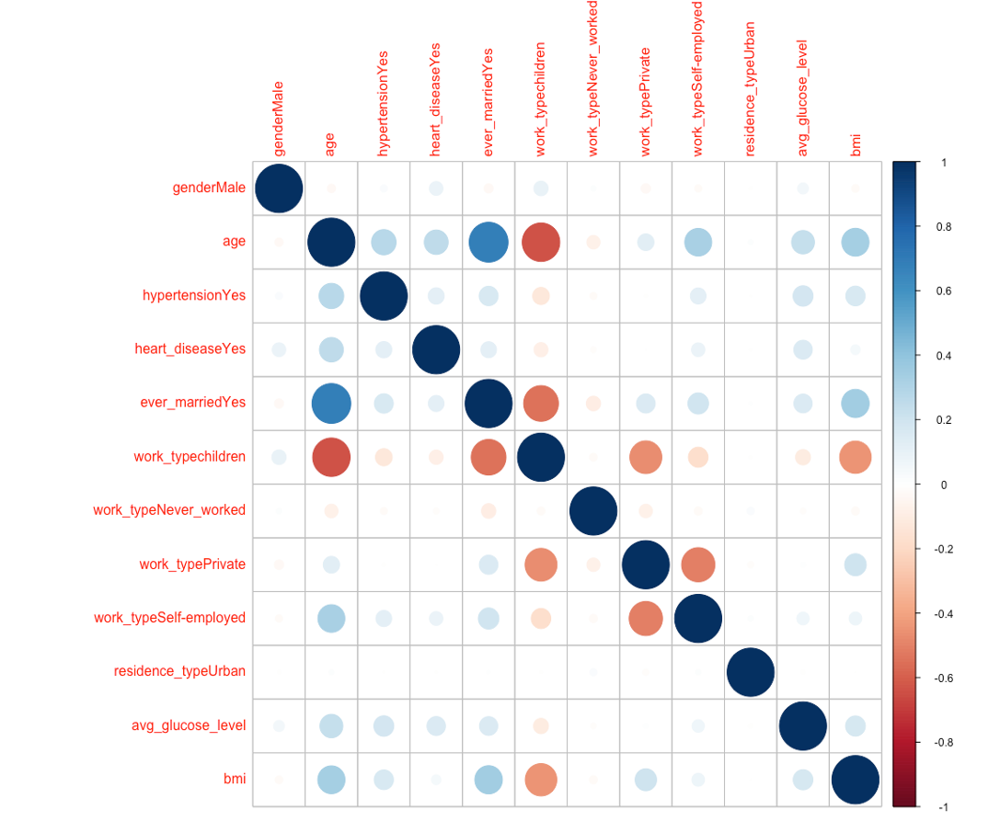
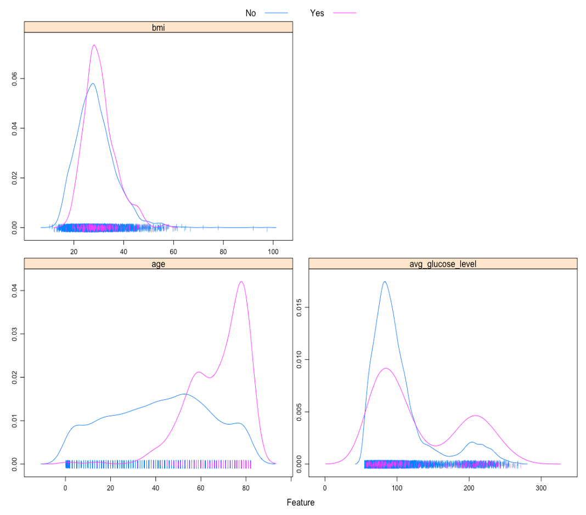

---
title: "Stroke Prediction Using Demographic and Clinical Variables"
output:
  html_document
--- 
*Contributors: Michelle Lee, Leo Liu, Yi Sun (MPH candidates at Columbia University)*

```{r setup, include=FALSE}
knitr::opts_chunk$set(
  echo = TRUE, 
  message = FALSE, 
  warning = FALSE,
  results = "asis"
)
```

### Introduction

Although stroke is preventable and treatable, it is a leading cause of death and serious disability for adults in the United States [1](https://www.cdc.gov/stroke/index.html). Globally, stroke causes over 6 million deaths per year. Also, 70% of strokes and 87% of both stroke-related deaths and disability occur in low and middle-income countries [2](https://www.who.int/bulletin/volumes/94/9/16-181636.pdf). Hence, predicting stroke cases based on certain health indicators might be beneficial in potentially preventing strokes in the world’s marginalized communities. 

We want to know whether the demographic and clinical characteristics in the dataset can be used to predict stroke event accurately. If so, the results may provide inspiration for early detection and intervention for stroke. Thus, the main research question is: Can the demographic and clinical variables in the dataset be used to build a model for stroke prediction? How accurate is the model? We will use Lasso, MARS, Random Forest, Boosting models to identify a stroke prediction model with the highest accuracy, and see which variables are important in making this prediction.

### About data

The dataset is used to predict whether a patient is likely to get stroke based on the input parameters like gender, age, various diseases, and smoking status. Each row in the data provides relevant information about the patient and was posted on online [3](https://www.kaggle.com/fedesoriano/stroke-prediction-dataset) by Federico Soriano Palacios. The original dataset consists of 5110 observations and 12 variables including: 

1) id: unique identifier
2) gender: “Male”, “Female” or “Other”
3) age: age of the patient
4) hypertension: 0 if the patient doesn’t have hypertension, 1 if the patient has hypertension
5) heart_disease: 0 if the patient doesn’t have any heart diseases, 1 if the patient has a heart disease
6) ever_married: “No” or “Yes”
7) work_type: “children”, “Govt_jov”, “Never_worked”, “Private” or “Self-employed”
8) Residence_type: “Rural” or “Urban”
9) avg_glucose_level: average glucose level in blood
10) bmi: body mass index
11) smoking_status: “formerly smoked”, “never smoked”, “smokes” or “Unknown”*
12) stroke: 1 if the patient had a stroke or 0 if not
*Note: “Unknown” in smoking_status means that the information is unavailable for this patient

### Data preparation
The “id” column was first removed. Then the "gender", "hypertension", "heart_disease", "ever_married", "work_type", "residence_type", "smoking_status", and "stroke" variables were set as factor variables. The “Unknown” level of “smoking_status” and the “N/A” value of “bmi” were recoded as missing values, and the “bmi” variable was set as a numeric variable then. 

After the missingness check, “smoking_status” was removed for too many missing values (n = 1544). Only 1 observation was in the “Other” category of “gender” and was also removed. The unused level “Other” of “gender” was dropped. Finally, the binary variables “hypertension”, “heart_disease” and “stroke” were recoded with “Yes” to replace “1” and “No” to replace “0”. The “No” level of “stroke” was set as the reference level for the subsequent analysis.
The primarily cleaned dataset consists of 5109 observations and 10 variables, including 1 outcome variable (“stroke”) and 9 predictor variables ("gender", “age”, "hypertension", "heart_disease", "ever_married", "work_type", "residence_type", “avg_glucose_level”, and “bmi”).

### Exploratory analysis/visualization
According to the correlation matrix plot (figure 1) having ever been married seemed to be positively associated with age and negatively associated with being in the “children” category of “work_type”. Being in the “children” category of “work_type” was negatively associated with age and BMI.



The density plots of continuous predictors across levels of “stroke” (figure 2) showed that observations with stroke event seemed to be older and have higher glucose level than those without stroke event in general.


The bar charts showing stroke event proportion across categories of categorical predictors (Figure 3) indicated that an apparently higher proportion of observations with hypertension, heart disease, or who had ever married had experienced stroke event compared to those in the other category. For “work_type”, only 2 observations in the “children” category and 0 observations in the “Never_worked” category had experienced stroke event.


Taking account of the above results and the actual meaning of “children” level of “work_type” (an age group rather than a work type), “work_type” was excluded from the subsequent analysis.

### Models 
The included predictor variables were "gender", “age”, "hypertension", "heart_disease", "ever_married", "residence_type", “avg_glucose_level”, and “bmi”. The data were partitioned into a training dataset and a test dataset by a 0.75/0.25 split. All models were fitted using train function in caret package. The training and test datasets were preprocessed with bagged tree imputation trained on the training dataset for missing values. The area under the ROC curve was used to select the optimal model using the largest value from 10-fold cross-validation with down sampling for imbalanced outcome (stroke/no stroke = 0.05).

#### Model 1: LASSO
Model 1 was fitted in the training dataset using LASSO regression. The assumptions being made by using LASSO regression include: (1) the outcome variable is binary, (2) the observations are independent of each other, and (3) there is linearity between predictor variables and the log odds of outcome event. The tuning parameter of LASSO, the amount of shrinkage or penalty parameter λ, was selected from e^(-7) to e^(-2). The λ that had the largest ROC from 10-fold cross-validation with down sampling were selected for the optimal LASSO model. In the optimal LASSO model, λ was 0.0313.

#### Model 2: MARS
Model 2 was fitted in the training dataset using MARS. There are no assumptions about the underlying functional relationship between the dependent and independent variables being made by using MARS. The tuning parameters of MARS, the degree of features and the number of predictors, were selected from 1 to 3 and from 2 to 15, respectively. The set of tuning parameters of MARS that had the largest ROC from 10-fold cross-validation with down sampling were selected for the optimal MARS model. In the optimal MARS model, the degree of features was 1, and the number of predictors was 3.

#### Model 3: Random Forest
Model 3 was fitted in the training dataset using random forest. There are no assumptions about the underlying functional relationship between the dependent and independent variables being made by using random forest. The number of randomly selected predictors for each split and the minimal terminal node size were selected from 1 to 8 and from 1 to 6, respectively. The set of tuning parameters that had the largest ROC from 10-fold cross-validation with down sampling were selected for the optimal random forest model. In the optimal random forest model, the number of randomly selected predictors for each split was 4, and the minimal terminal node size was 5. The splitting rule of trees was set as Gini index. The number of trees was set as 500.

#### Model 4: AdaBoost
Model 4 was fitted in the training dataset using adaptive boosting (AdaBoost). There are no assumptions about the underlying functional relationship between the dependent and independent variables being made by using AdaBoost. The tuning parameters of AdaBoost, the number of trees, the maximal interaction depth, the shrinkage parameter λ and the minimal terminal node size, were selected from 500, 1000 and 2000, from 1 to 3, from 0.001, 0.003 and 0.005, and from 1 to 6, respectively. The set of tuning parameters of AdaBoost that had the largest ROC from 10-fold cross-validation with down sampling were selected for the optimal AdaBoost model. In the optimal AdaBoost model, the number of trees was 500, the maximal interaction depth was 2, the shrinkage parameter λ was 0.005, and the minimal terminal node size was 4.

### Model performance and selection
The training performance of models was estimated using resampling areas under the ROC curves in the training dataset from 10-fold cross-validation with down sampling (Figure 4), and the test performance of models was estimated using the areas under the ROC curves in the test dataset (Figure 5). 


Model 4 (AdaBoost) was selected as the final model since the mean of resampling areas under the ROC curves of model 4, which was 0.845, was the largest among all models. The area under the ROC curve of model 4 in the test dataset was 0.844. In the final model, age was the most important variable in predicting stroke event, followed by average glucose level, BMI, hypertension, residence type, heart disease, gender, and marital status (Figure 6).


#### Discussion
One limitation of the models, especially random forest and AdaBoost, is the long computation time for estimating the optimal model through cross-validation, which could be even longer when more variables are included. Besides, due to the limited computational resources, the tuning grid for Model 4 (AdaBoost) was rough, and only a few sets of tuning parameters were tried. Overall, we think the models that have been tried are flexible enough to capture the underlying truth. One reason why the truth may not be captured is the imperfectness of the available data, a condition we face all the time. In this analysis, available variables and observations, especially stroke cases, may not be sufficient, and there were missing values that needed to be handled in the dataset.

#### Conclusion
The demographic and clinical variables in the dataset can be used to build a model for stroke prediction. The final model in this analysis was an AdaBoost model, and the area under the ROC curve of the final model in the test dataset was 0.844. The findings are in line with our expectations. According to the findings, age was an important variable for stroke prediction, and the test performance of the final model was good.
